# Fin-R1-Pro：察势、慧算、通达

<!--  -->

 **察势：洞察市场趋势，识别投资机会**

 **慧算：智慧精算分析，推理精准深入**

 **通达：融会贯通知识，全面理解金融**


继Fin-R1(7B)模型发布之后，我们非常高兴地推出**Fin-R1-Pro(32B)**——一款在**模型规模与金融能力**之间实现双重突破的金融大模型。它不仅具备超大参数规模，更在专业金融推理、知识理解与任务泛化方面实现质的跃升。Fin-R1-Pro(32B)以超百万条高质量金融语料为基础，融合自主研发的五阶段数据合成与筛选策略，显著提升模型的语义理解、数值推理与任务泛化能力。在这一代模型中，我们在多个维度实现了突破式跃升——从文本理解到复杂推理，从知识掌握到场景应用，Fin-R1-Pro(32B)在多个权威金融Benchmark上表现领先，它不仅更聪明，也更稳健，真正实现了「让模型懂金融、会思考、能行动」，标志着金融智能迈入全新阶段。

**表1：Fin-R1(7B)与Fin-R1-Pro(32B)对比**

| 维度 | Fin-R1（7B） | Fin-R1-Pro（32B） |
|------|-------------|------------------|
| 模型参数 | 7B | **32B** |
| 训练数据量 | 100K-level | **1M-level** |
| 数据处理 | 基础数据清洗 | **五阶段数据合成与筛选** |
| 核心算法 | GRPO | **自研SRPO算法\*** |
| 综合能力 | 表现优异 | 多个权威榜单(FinQA、ConvFinQA、BizBench、FinEval、Fineva、XBRL等)实现SOTA 🏆 |

注\*：Self-Adaptive Reward Policy Optimization

## 在线体验

您可以通过以下网址在线体验 Fin-R1-Pro：

🌐 **线上网址：** https://finr3.nas.cpolar.cn/

## 核心亮点

Fin-R1-Pro的目标，是让模型不仅能"理解"金融数据，更能洞察市场、推演逻辑、辅助决策。为此，我们在六大能力维度上实现系统性突破——从知识到认知，从推理到执行，全面重塑金融智能的边界：

### 五阶段数据合成与筛选：重塑金融认知的"精细打磨术"

Fin-R1-Pro采用自主研发的五阶段数据合成与推理蒸馏策略，融合银行、证券、保险、信托、期货、基金等六大行业数据，完成从数据清洗、知识抽取到逻辑蒸馏的全流程进化，让模型在复杂金融语义中具备更细腻的理解与更稳健的逻辑链构建能力。

### 32B超大参数规模：解锁金融能力的"跃迁式升级"

在大参数规模的支撑下，Fin-R1-Pro实现了从通用语言模型到专业金融大模型的跨越。无论是财报计算、资产估值还是宏观推理，模型均能展现出行业领先的语义一致性与数值精度，实现能力与规模的双向跃升。

### 全链路金融任务闭环：从"理解"到"行动"的端到端贯通

模型能够理解、推理并执行全链条金融任务，实现从数据认知到决策辅助的闭环进化。在投研分析、量化策略、风险评估等任务中，模型不仅能洞察因果逻辑，更能生成可执行的智能方案。

### 多层次金融认知体系：让模型真正"懂金融、会思考"

通过多层次认知建模框架，体系化捕捉金融实体、概念与逻辑关系，模型能够精准理解市场语义与政策脉络，具备真正的金融思维与情境推理能力，实现从"知道"到"理解"的跃迁。

### 智能风控与合规守护：构建金融安全的"智能防线"

内置多维风控与合规识别机制，可自动识别欺诈、洗钱、内幕交易、行业合规等潜在风险，并生成可解释的分析理由，为金融机构提供可追溯、透明且高可靠的智能防控支持。

### 多场景金融应用引擎：驱动智能金融的"全生态扩展"

Fin-R1-Pro在银行信贷、证券投研、保险精算、信托管理、基金配置与期货交易等场景中均展现出卓越表现。模型可作为金融智能体核心底座，为机构级与个人级业务提供可落地的智能解决方案。

## 技术路线

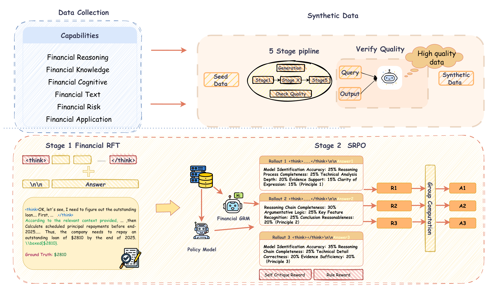

*图1: 技术路线图*

我们在数据处理、监督微调、强化学习各方面作了全面创新，使用**五阶段数据合成**、两阶段训练过程，通过高质量推理数据集、先进强化学习算法，优化模型的推理过程。具体地，我们通过自研的五阶段数据合成流程在**百万量级**数据中筛选出高质量结构化数据，接着通过监督微调提高模型金融领域能力的同时结构化输出内容。最后我们提出了**SRPO**算法，通过自适应强化学习算法，将生成式的奖励模型与基于规则的奖励相结合，有效解决了传统基于规则的奖励单一、固定，难以覆盖复杂、多样化场景以及人工设定评分原则静态、有限，难以适应语境动态变化和用户需求多变的问题，能够获取更加精确、细粒度的奖励信号，实现模型能力的进一步提升。

## 模型性能

我们在多个国际通用与金融专用评测体系上全面评估了**Fin-R1-Pro**的综合能力。结果表明，该模型在金融任务中表现出卓越的专业深度与稳定性，在通用任务上同样保持了优异的语言、推理与知识泛化能力。这一成果验证了Fin-R1-Pro作为新一代**兼顾规模与金融智能**的模型，在专业性与通用性之间实现了真正的平衡与突破。

### 金融能力

我们重点在多个金融专用基准上系统评估了Fin-R1-Pro的行业智能表现，涵盖以下**六大核心能力维度**：

- **金融推理能力**：处理多步推导的复杂问题，在数值计算、逻辑链条建模与因果归因等任务中展现严密性与准确性。
- **金融认知能力**：深度解读市场动态、政策意图与商业行为背后的微观逻辑，形成对金融生态的系统性理解与洞察。
- **金融知识能力**：融合银行、证券、保险、信托、期货等多元知识，具备高效的跨领域知识调用与关联推理能力。
- **金融文本能力**：专精于处理公告、研报、财报及监管文件，能够精准完成信息抽取、实体识别与因果脉络梳理。
- **金融风控能力**：主动侦测欺诈、洗钱及内幕交易等风险信号，并提供具有清晰逻辑依据与证据支撑的风险判断。
- **金融应用能力**：面向投研、量化、风控等核心场景，提供端到端的可执行方案，实现从分析到决策的智能闭环。

在这六大维度下，Fin-R1-Pro在各项评测中均实现领先表现，构建起完整的金融智能能力框架，体现出从**知识理解 → 逻辑推理 → 决策执行**的系统化跃升。

为了系统展示模型在不同层面的能力表现，我们从**权威数据集评测结果**、**综合数据集表现**以及**特定任务子集效果**三个角度进行了对比分析，以下图表清晰呈现了Fin-R1-Pro在金融智能领域的全面优势：

#### 权威数据集评测：Fin-R1-Pro在全域金融任务中的整体领先

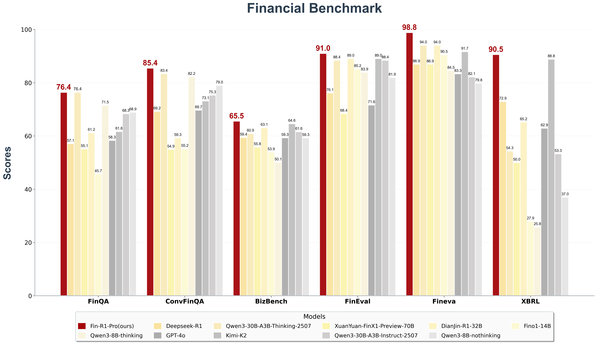

*图2: Fin-R1-Pro与先进开闭源模型的比较*

Fin-R1-Pro构建了多维度、全链路的能力矩阵，不仅覆盖从人类思考到决策输出的完整流程，更在复杂场景下展现出卓越的泛化能力与鲁棒性，能高效应对金融各领域任务挑战。在金融推理、金融知识、金融认知、金融合规、金融安全、金融应用领域全方位展现出了卓越性能，超过了GPT-4o、Deepseek-R1、Qwen3-30B-A3B-Thinking-2507等先进开闭源模型，Fino1-14B、DianJin-32B等金融垂域模型。在极具挑战性的金融推理计算FinQA、ConvFinQA、BizBench、专注于金融认知与金融知识的Fineval、聚焦于金融合规与安全的Fineva、致力于金融财报结构化分析的XBRL基准测试上均表现优异，远超同参数金融垂域模型，优于超大参数通用模型。

#### 综合数据集评测：多任务协同下的稳健泛化表现

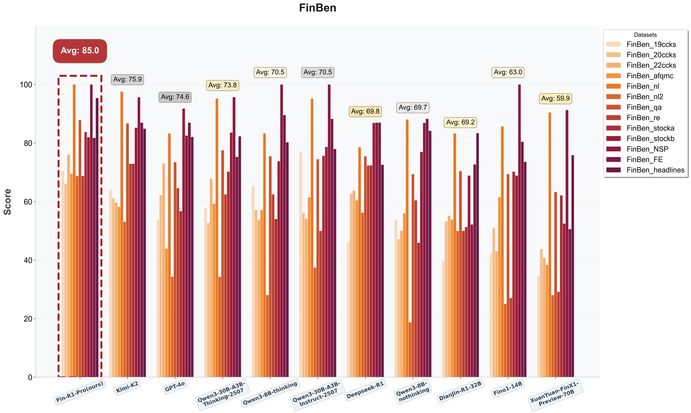

*图3: Fin-R1-Pro与先进开闭源模型的比较*

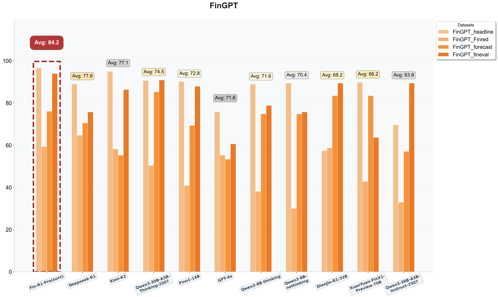

*图4: Fin-R1-Pro与先进开闭源模型的比较*

我们的模型在FinBen和FinGPT上表现优异，分别以85.0和84.2的加权得分超过了GPT-4o、Deepseek-R1、Qwen-30B-A3B-Instruct-2507等先进开闭源模型,DianJin-R1-32B、Fino1-14B等金融垂类模型，展现了Fin-R1-Pro在涉及金融知识、文本、推理、情绪识别、应用领域强大的综合能力。这一结果表明，Fin-R1-Pro在**专业语境理解、语义一致性与逻辑判断**方面实现系统性突破，能够基于丰厚的金融知识，精确理解各种形式的金融文本，进行严谨缜密的逻辑推理，最终生成可信结论，**成为当前最具真实语境理解力的金融大模型之一。**

#### 六维度任务表现：在关键金融各任务上的深度突破

##### ①金融推理能力方面——逻辑严谨

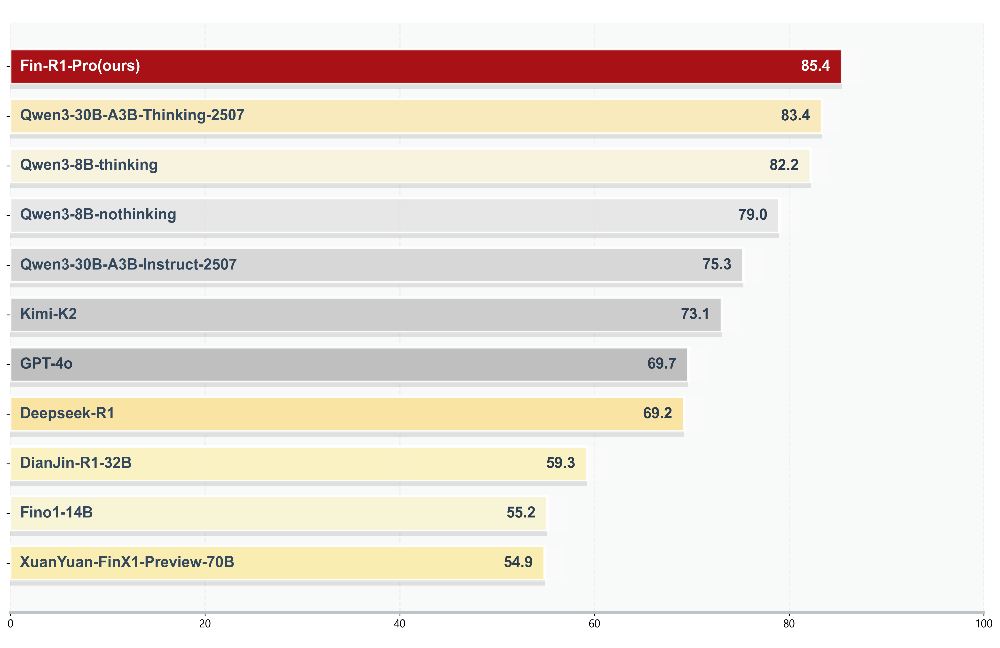

*图5: Fin-R1-Pro与先进开闭源模型的比较*

金融推理领域的强逻辑性与计算严谨性，让大多数先进模型例如GPT-4o、DeepSeek-R1、DianJin-R1-32B等有较大提升空间，而Fin-R1-Pro在**FinQA、ConvFinQA、TATQA等**金融推理数据集上表现出色，取得**85.4分**的领先成绩，能够在多步推理中精准处理财务数据与语言条件，构建稳定的推理链条实现**真正"理解"金融问题，而不仅仅是回答问题。**

##### ②金融认知能力方面——洞察精准

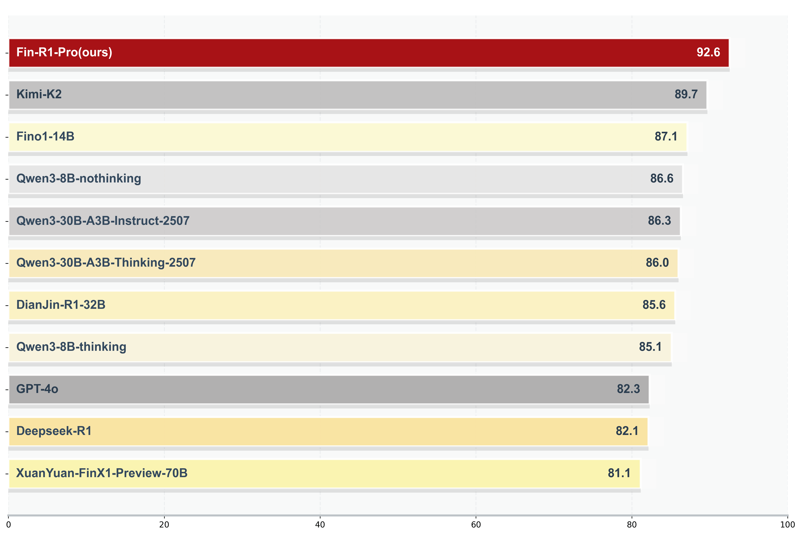

*图6: Fin-R1-Pro与先进开闭源模型的比较*

金融市场的在语义与行为逻辑上的独特性使得Deepseek-R1与GPT-4o等主流模型表现不佳，但Fin-R1-Pro以亮眼的表现在**PIXIU_enfpb、Finance_Instruck_500K、Finova等**金融认知数据集上取得**92.6分**，能够更好地捕捉经济情境与政策含义，在宏观趋势、行业逻辑与企业行为的理解上更贴近真实金融语境，实现**不仅"算得对"，更"想得明白"。**

##### ③金融知识能力方面——融会贯通

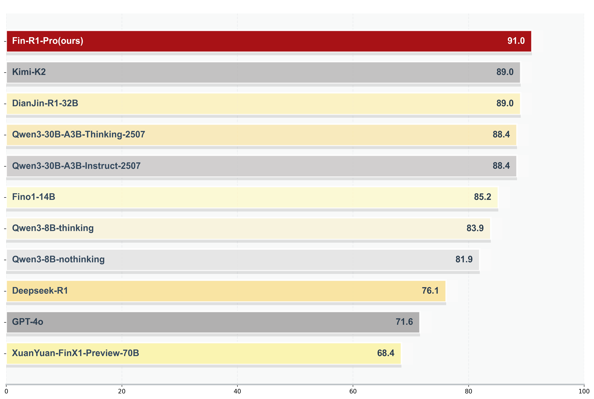

*图7: Fin-R1-Pro与先进开闭源模型的比较*

Fin-R1-Pro在金融知识理解与应用层面实现全面突破。在**Fineval、FinanceIQ、CFLUE**等数据集上表现优异，取得**91.0分**，领先Kimi-K2、DianJin-R1-32B与Qwen3-30B系列模型。该结果显示模型具备稳健的金融知识结构与推理融合能力，能在估值逻辑、风险评估、宏观政策等问题上给出更具解释性的判断。**Fin-R1-Pro不只是"知道"，更能"用知识去推理"。**

##### ④金融文本能力方面——解析透彻

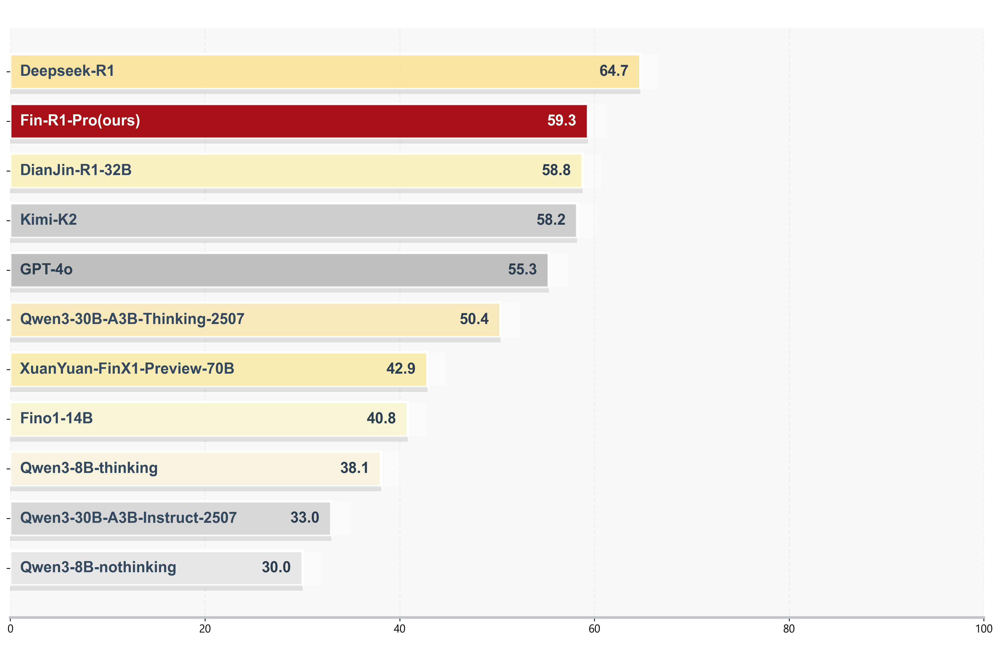

*图8: Fin-R1-Pro与先进开闭源模型的比较*

深度的文本解析能力不仅要求准确识别财报公告中的关键实体及其关联，还要敏锐捕捉复杂金融文本中隐含的因果逻辑与情感倾向。在这类任务上Fin-R1-Pro展现出优异表现，在**FinGPT_finred、EDTSUM、FinBen_na**等数据集上以**59.3分**排名第二，仅次于DeepSeek-R1，领先GPT-4o与多款金融专用模型，能够精准抽取公告与新闻中的实体关系，并理解复杂语句中的因果与情绪隐含，展现出强大的语言解析能力。**在真实场景中，Fin-R1-Pro能从文本中"读出市场"，而不仅仅是"读懂文字"。**

##### ⑤金融风控能力方面——预警前瞻

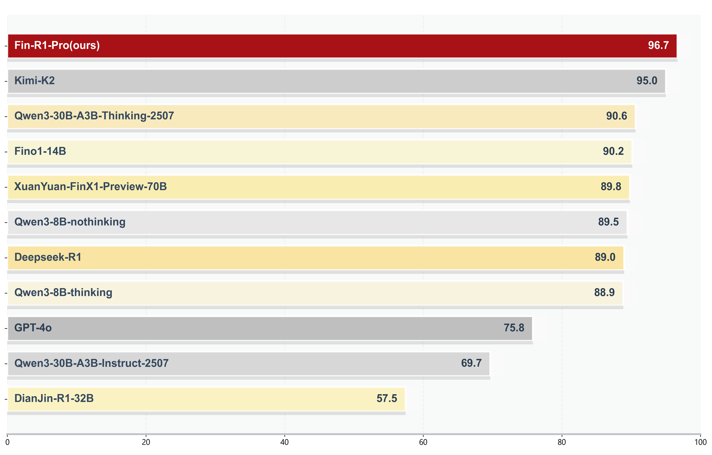

*图9: Fin-R1-Pro与先进开闭源模型的比较*

风险识别与合规判断方面Fin-R1-Pro表现突出，在**FinGPT_headline、FinEva、FinancialPhraseBank**等数据集上表现出色，取得**96.7分**的最高成绩，显著超越GPT-4o、DeepSeek-R1与多款先进模型，能够准确识别新闻与公告中的潜在风险信号、市场波动趋势及舆情情绪，为风控预警和合规审查提供智能支持，**不仅能理解市场，还能"先于市场发现风险"。**

##### ⑥金融应用能力方面——业务精通

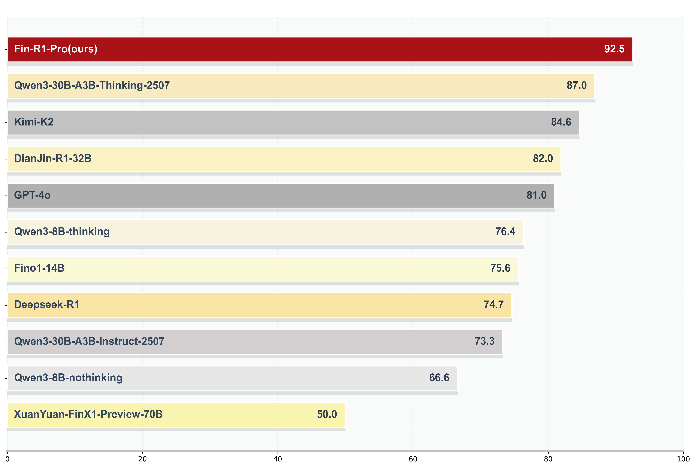

*图10: Fin-R1-Pro与先进开闭源模型的比较*

Fin-R1-Pro在真实业务场景中的表现同样亮眼。在**banking77、XBRL、PIXIU_acl**等数据集上表现优异，取得**92.5分**，显著领先Qwen3-30B-A3B-Thinking-2507、Kimi-K2与GPT-4o等模型。模型能快速理解银行业务语义，处理咨询、投诉、产品解释等多类任务，展现出高实用性的语言理解与任务执行能力。**它不只是研究模型，而是能直接参与金融服务工作的智能助手**

### 业务场景能力

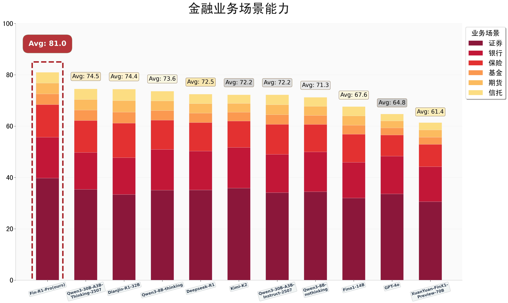

*图11: 业务场景能力*

为精准衡量在真实金融业务中的表现，我们搭建了证券、银行、保险、基金、期货、信托六大评测场景，覆盖金融行业全领域业务。从证券场景下的投研决策，到银行行业下的风险评估等，深度对标金融行业核心业务逻辑与实际运作流程，以真实业务需求为出发点，确保评测与行业实际应用紧密贴合，兼具真实性与有效性。

#### 业务场景示例

##### ① 证券行业

📹 [股票-金融数理价格计算视频](股票-金融数理价格计算.mov)

##### ② 银行行业

📹 [银行信贷视频](银行信贷.mov)

##### ③ 保险行业

📹 [保险相关视频](保险相关.mov)

##### ④ 基金行业

📹 [证明两基金分离定理视频](证明两基金分离定理.mov)

##### ⑤ 期货行业

📹 [期货相关视频](期货相关.mov)

##### ⑥ 信托行业

📹 [债转股问题视频](债转股问题.mov)

### 通用能力

我们系统评估了Fin-R1-Pro在通用能力方面的表现，以评估模型在金融智能范围之外是否保留了原有的通用知识和推理能力，重点聚焦于以下两大核心维度：

- **知识能力：**在MMLU_PRO与GPQA权威基准测试中，MMLU_PRO涵盖法学、医学、计算机科学、艺术学等14个学科，GPQA涵盖生物学、物理学、化学的专家难题。模型展现出广泛且深度的知识覆盖与跨学科理解能力，能够准确处理高复杂度、跨领域的科学知识性问题。
- **数学能力：**在MATH-500评测集上，模型表现出优秀的数学推理与解题能力，涵盖代数、几何、概率等多个数学分支，体现出扎实的数值运算与逻辑分析基础。

通过上述综合评测，**Fin-R1-Pro在通用知识与数学推理两大领域均展现出与通用模型相当的竞争力和稳健表现，奠定了其在广泛知识理解到复杂逻辑推理的扎实能力根基。**

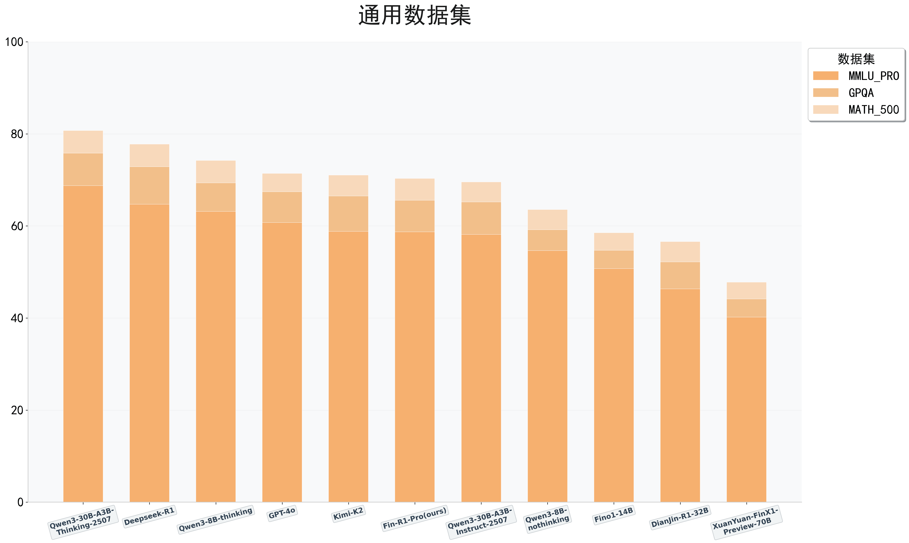

*图12: Fin-R1-Pro与先进开闭源模型的比较*

Fin-R1-Pro拥有系统化的通用能力框架，在**知识理解**与**数学推理**两大关键维度上表现稳健。在极具挑战性的通用评测基准中，该模型展现出与**主流先进模型相当的竞争力**：在专业深度极强的GPQA知识问答中成绩突出，在涵盖多学科的MMLU-Pro上也表现稳定；尤其在竞赛级数学数据集MATH-500中，其推理能力**优于Kimi-K2、GPT-4o及Qwen3-30B-A3B-Instruct-2507**模型，体现出**扎实的数值推理与逻辑分析能力**。整体结果表明，Fin-R1-Pro在通用认知与推理任务中**具备可靠的综合性能**。

#### 知识能力方面

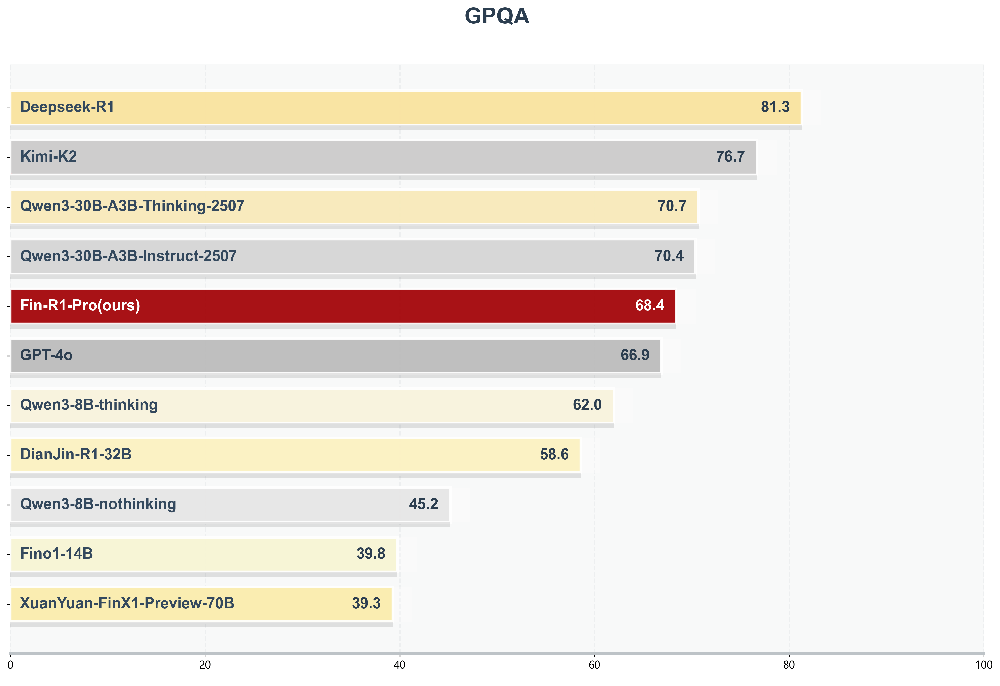

*图13: Fin-R1-Pro与先进开闭源模型的比较*

在**衡量深度、专业知识的权威**基准上，Fin-R1-Pro展现出扎实的学科基础。在极具挑战性的专家级科学数据集GPQA上，Fin-R1-Pro以68.4的得分比肩GPT-4o、Kimi-K2等主流通用模型，显著超越Fino1-14B等金融模型，这表明Fin-R1-Pro具备了跨学科的深度知识理解与综合应用能力。

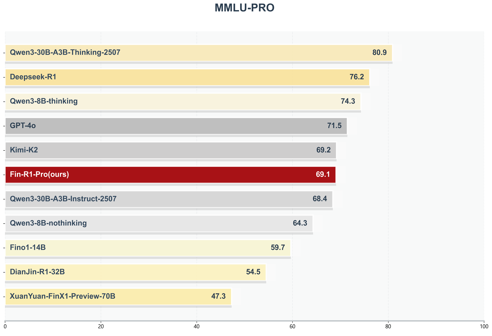

*图14: Fin-R1-Pro与先进开闭源模型的比较*

在增强版的**大规模多任务理解**数据集MMLU-PRO上，Fin-R1-Pro表现出良好的解决跨学科复杂问题的能力，以69.1分与GPT-4o、Kimi-K2等专业通用模型几乎持平，显著优于Fino1-14B等金融模型，展现了其在通用领域不俗的跨学科素养。

#### 数学能力方面

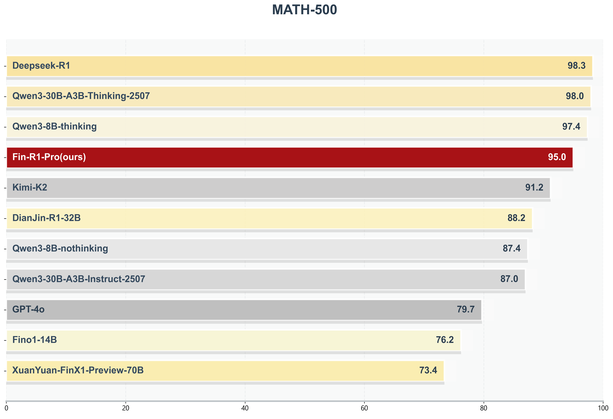

*图15: Fin-R1-Pro与先进开闭源模型的比较*

在**竞赛级数学推理基准MATH-500**上，Fin-R1-Pro展现了卓越的数值计算与逻辑分析能力，以95.0分位居前列。其表现显著超越了**GPT-4o**(79.7%)、**Kimi-K2**(91.2%)及**Qwen3-8B的非思考模式**(87.4%)等多个主流闭源与开源模型，凸显了其在**复杂数学问题上稳定而强大的推理性能**。

## 实际应用落地场景

在 **Agent 智能体应用**方面，结合多模块推理链路，Fin-R1-Pro能驱动智能体执行 "行情分析→报告生成→策略建议" 等任务流，实现**端到端研报生成与策略输出**。智能体通过内置API接口抓取行情、财务和市场情绪数据，实现多源数据实时聚合与校验；通过行情复盘、板块分析和个股聚焦实现结构化输出，并辅助策略预判；驱动智能体自动生成合规格式，并进行场景审核和风险提示；最后根据用户自然语言输入触发个性化需求，实现研报生成。

### 演示案例

**用户请求：** 请为我生成2025年10月30日的债券分析报告

**Fin-R1-Pro 响应：** 好的，正在为您生成2025年10月30日债券分析报告......

#### 1. 调用数据收集工具

🔍 正在从 mySQL 数据库获取最新数据……

📝 编写 mySQL 语句……

💡 SELECT "indicator_value" FROM bond_data_db_daily WHERE "indicator_name" in data_source_set AND "date" in "2025-10-29 00:00:00"

```
{
  "DR007.IB_high": 1.68,
  "DR007.IB_low": 1.4,
  "SPTAUSDOZ.IDC": 3948.5,
  "上证指数\"收盘价[单位] 元\"": 3988.224,
  "中国:回购定盘利率:7天(FR007)": 1.63,
  "中国:国债到期收益率:5年": 1.576,
  "中国:逆回购数量:7天": 4753.0,
  "创业板指数": 3229.575,
}
```

💡 SELECT "indicator_value" FROM bond_data_db_daily WHERE "indicator_name" in data_source_set AND "date" in "2025-10-28 00:00:00"

```
{
  "DR007.IB_high": 1.65,
  "DR007.IB_low": 1.4,
  "SPTAUSDOZ.IDC": 4006.7,
  "上证指数\"收盘价[单位] 元\"": 4016.331,
  "中国:回购定盘利率:7天(FR007)": 1.6,
  "中国:国债到期收益率:5年": 1.578,
  "中国:逆回购数量:7天": 5577.0,
  "创业板指数": 3324.271,
}
```

#### 2. 调用绘图制表工具

🎨 正在使用获取的数据进行图表绘制……

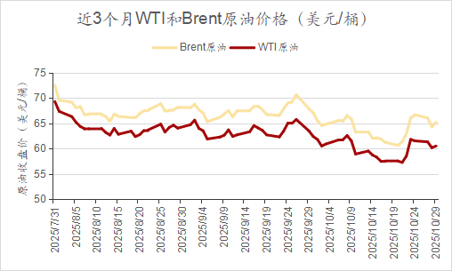

#### 3. 调用新闻源搜集工具

🚀 正在连接至博查 AI 平台……

🚀 连接成功！

🔗 浏览网页 https://finance.eastmoney.com.cn/roll/2025-10-31/doc-infvtwru8744871.shtml......

市场普遍认为降息周期已近尾声，但强势欧元与通胀压力或迫使央行未来重新评估政策……

🔗 浏览网页 https://news.qq.com/rain/a/20251031A0238400......

当地时间10月30日上午，国家主席习近平乘专机抵达韩国，应大韩民国总统李在明邀请，出席亚太经合组织第三十二次……

🔗 浏览网页 https://finance.eastmoney.com/a/202510303550899622.html......

美方将暂停实施其9月29日公布的出口管制50%穿透性规则一年。中方将暂停实施10月9日公布的相关出口管制等措施一年，并将研究细化具体方案……

🔗 浏览网页 https://www.yicai.com/news/102888736.html......

要纠治急功近利、盲目决策问题，各地区各部门谋划"十五五"工作要从实际出发，防止盲目冲动跟风、指标层层加码等问题。10月28日，中央层面整治形式主义为基层减负……

#### 4. 调用文字生成工具

📄 正在生成研究报告分析文字……

📝 正在进行总结与合并……

💡 最新数据显示(2025年10月30日)，7天逆回购利率为1.40%，与前一交易日持平；7天逆回购数量为3426亿元，相对于前一交易日(2025年10月29日)的5577亿元有所减少。根据央行网站消息，10月30日中国人民银行以固定利率、数量招标方式开展了3426亿元7天期逆回购操作，操作利率维持在1.40%水平。央行连续多日保持逆回购利率稳定，显示货币政策维持中性偏松基调。近期逆回购操作规模波动较大，从10月24日的1680亿元逐步增加至10月29日的5577亿元，随后……

#### 5. 调用核查工具

❌ 正在进行数据真实性复核……

❌ 正在进行文字一致性复核……

❌ 正在进行内容专业性复核……

💡 复核完成！研报生成成功！

📹 [32B模型演示视频](32b.mov)

## 联系我们

Fin-R1-Pro由上海财经大学统计与数据科学学院教授、AI财经开发与服务中心主任张立文与其领衔的金融大语言模型课题组（SUFE-AIFLM-Lab）研发，诚邀业界同仁共同探索 AI 与金融深度融合的创新范式，共建智慧金融新生态。

- **电子邮件：** zhang.liwen@shufe.edu.cn、dpcheng_23@foxmail.com
- **GitHub：** https://github.com/SUFE-AIFLM-Lab
